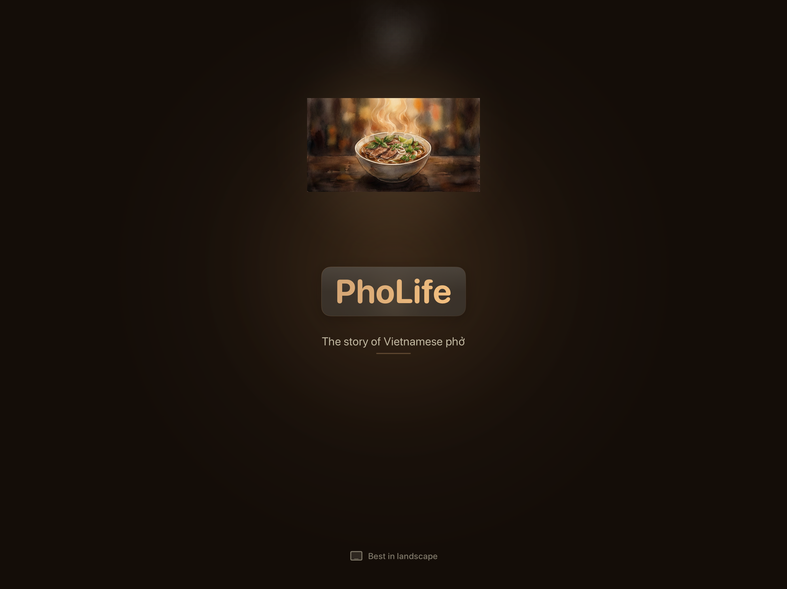
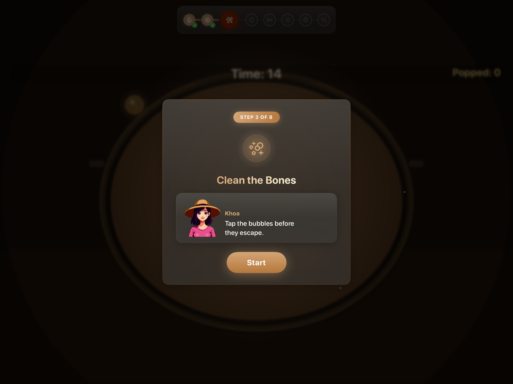
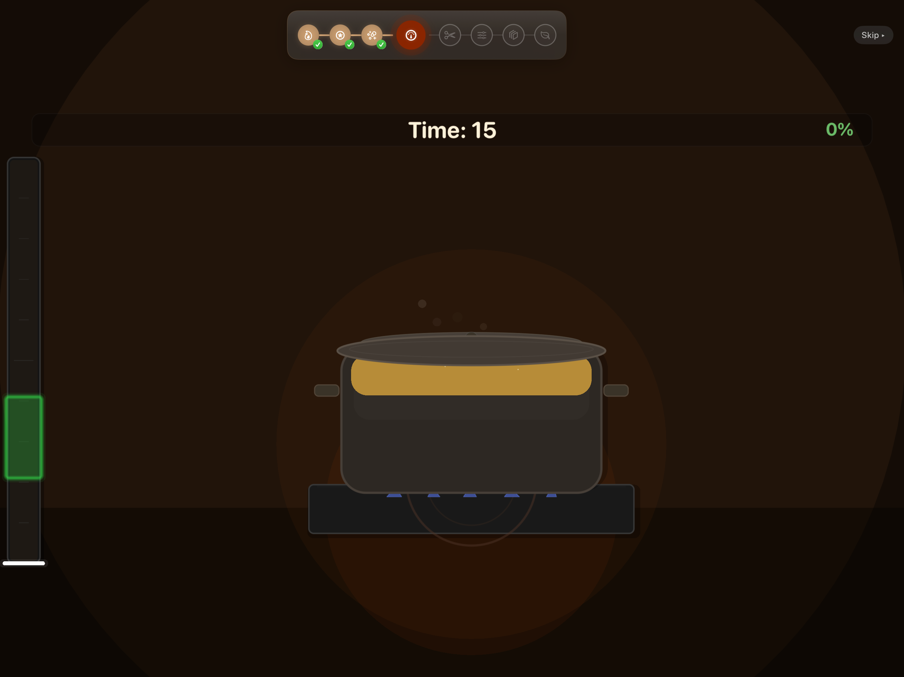
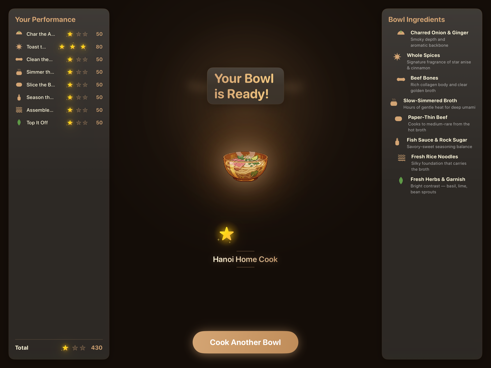

# PhoLife 🍜

> The story of Vietnamese phở, from a bowl of history to a bowl you cook yourself.


**PhoLife** is an interactive story-and-cooking game for iPad and Mac that teaches the history and
craft of Vietnamese phở. You follow the dish from its origins on the Red River through French
colonial kitchens, a divided country, and the diaspora that carried it across oceans. Then you cook a
bowl yourself across eight minigames, guided by a narrator named Khoa Nguyen.

Built entirely with Apple frameworks (SwiftUI, SpriteKit, AVFoundation) in Swift 6, with zero
third-party dependencies. Winner of Apple's Swift Student Challenge 2026.

## 📸 Screenshots

| Splash | Story |
| :---: | :---: |
|  |  |

| Minigame intro | In the kitchen | Your finished bowl |
| :---: | :---: | :---: |
|  |  |  |

## How It Plays

The game runs in four phases:

1. **Splash.** Ingredient icons converge into a steaming bowl.
2. **Story.** A ten-panel history of phở, narrated with typewriter dialogue and pixel-art portraits.
3. **Cook.** Eight cooking minigames, each with an intro card and a star-and-score reveal.
4. **Completion.** A results dashboard with stars, an earned rank, and your finished bowl.

Each minigame maps to a real step in making phở:

| Minigame | Mechanic |
|----------|----------|
| Char the Aromatics | Tap inside a shrinking timing target |
| Toast the Spices | Swipe to catch the right spices, dodge the decoys |
| Clean the Bones | Tap rising scum to clear the broth |
| Simmer the Broth | Hold to keep the heat in the simmer zone |
| Slice the Beef | Time your cut for paper-thin slices |
| Season the Broth | Balance fish sauce, salt, and sugar |
| Assemble the Bowl | Layer ingredients in the right order |
| Top It Off | Match toppings to their role |

## Built With

- **Swift 6** with strict concurrency
- **SwiftUI** for UI, navigation, and `Canvas`-drawn vector art
- **SpriteKit** for the eight minigame scenes and effects
- **AVFoundation** for layered music plus sound effects synthesized at runtime
- No third-party dependencies

Targets iPadOS 17+ and macOS 14+, landscape-first.

## Running It

Open `PhoLife.swiftpm` in Xcode 16+ or Swift Playgrounds and press Run. Best experienced in landscape.

```bash
git clone https://github.com/henry-tran07/PhoLife.git
```

## Project Structure

```
PhoLife.swiftpm/
├── PhoLifeApp.swift     # @main entry point
├── ContentView.swift    # Phase router
├── Models/              # GameState, StoryPanel, PhoIngredient, CulturalFact
├── Services/            # Audio, sound synthesis, haptics, fonts
├── Features/            # Splash, Story, Minigames (+ Scenes), Completion, Shared
└── Resources/           # Assets.xcassets + background music
```

## License

[MIT](LICENSE) © 2026 Henry Tran
